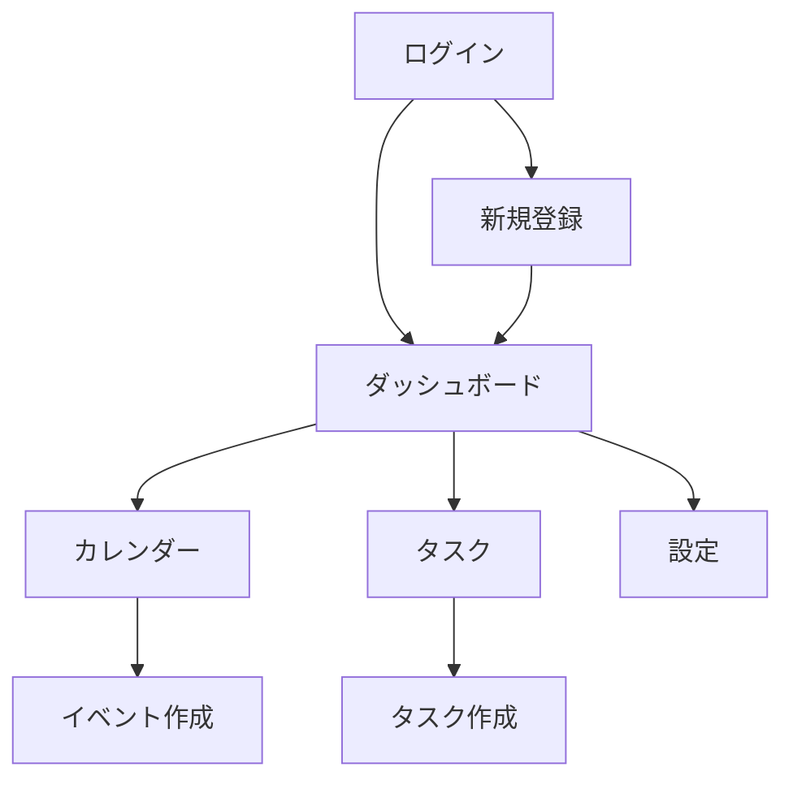

# GridMe 画面設計書

## 🎯 プロジェクト概要
GridMeは、Z世代向けのスケジュール管理・カレンダーアプリケーションです。「シンプルだけどワクワクする」デザインコンセプトに基づき、直感的で楽しい体験を提供します。

## 📱 画面構成

### 1. 認証関連画面

#### 1.1 ログイン画面 (`/login`)
**コンポーネント構成:**
- ロゴ/アプリ名表示
- メールアドレス入力フィールド (`input`)
- パスワード入力フィールド (`input` type="password")
- ログインボタン (`btn-primary`)
- 「パスワードを忘れた方」リンク
- 「新規登録」ボタン (`btn-ghost`)
- ソーシャルログインボタン群
- 背景: グラデーションメッシュ (`gradient-mesh`)

#### 1.2 新規登録画面 (`/signup`)
**コンポーネント構成:**
- 進捗インジケーター (`progress-bar`)
- ユーザー名入力フィールド (`input`)
- メールアドレス入力フィールド (`input`)
- パスワード入力フィールド (`input`)
- パスワード確認フィールド (`input`)
- 利用規約同意チェックボックス (`switch`)
- 登録ボタン (`btn-primary`)
- 「既にアカウントをお持ちの方」リンク

#### 1.3 パスワードリセット画面 (`/reset-password`)
**コンポーネント構成:**
- 説明テキスト
- メールアドレス入力フィールド (`input`)
- 送信ボタン (`btn-primary`)
- 戻るボタン (`btn-ghost`)

### 2. メイン機能画面

#### 2.1 ダッシュボード/ホーム画面 (`/dashboard`)
**コンポーネント構成:**
- ナビゲーションバー（共通コンポーネント）
  - ロゴ
  - メニューアイコン
  - 通知アイコン (`badge`付き)
  - プロフィールアバター (`avatar`)
- ウェルカムメッセージ（グラデーションテキスト）
- 今日の予定カード (`card-glass`)
  - 時間表示
  - イベントタイトル
  - 場所/参加者情報
- 週間サマリーウィジェット (`card`)
- クイックアクションボタン群
  - 新規予定作成 (`btn-primary`)
  - タスク追加 (`btn-secondary`)
- ミニカレンダーウィジェット
- 統計情報カード群（`card` グリッドレイアウト）

#### 2.2 カレンダービュー画面 (`/calendar`)
**コンポーネント構成:**
- ビュー切り替えタブ (`tabs`)
  - 月表示
  - 週表示
  - 日表示
- 日付ナビゲーション
  - 前へ/次へボタン (`btn-icon`)
  - 今日ボタン (`btn-ghost`)
  - 日付ピッカー（カスタムコンポーネント）
- カレンダーグリッド（カスタムコンポーネント）
  - 日付セル
  - イベントブロック（色分け）
  - ドラッグ&ドロップ対応
- フローティングアクションボタン (`btn-primary` + グロウ効果)

##### 2.2.1 月表示
- 7×5または7×6のグリッド
- 各セルに日付とイベントサマリー
- オーバーフロー時の「+n件」表示

##### 2.2.2 週表示
- 時間軸付き7日間表示
- タイムスロット（30分単位）
- イベントの重なり処理

##### 2.2.3 日表示
- 24時間タイムライン
- 詳細なイベント情報表示
- タスクリスト統合

#### 2.3 イベント作成/編集モーダル
**コンポーネント構成:**
- モーダルオーバーレイ (`modal`)
- タイトル入力 (`input`)
- 日時選択
  - 開始日時ピッカー（カスタムコンポーネント）
  - 終了日時ピッカー（カスタムコンポーネント）
  - 終日チェックボックス (`switch`)
- 場所入力 (`input` + オートコンプリート)
- 参加者追加（カスタムコンポーネント）
  - メールアドレス入力
  - 参加者リスト表示
- カテゴリー選択（ドロップダウン）
- リマインダー設定
- 詳細説明 (`textarea`)
- 繰り返し設定（カスタムコンポーネント）
- 保存ボタン (`btn-primary`)
- キャンセルボタン (`btn-ghost`)

#### 2.4 タスク管理画面 (`/tasks`)
**コンポーネント構成:**
- フィルター/ソートバー
  - カテゴリーフィルター（チップス形式）
  - ステータスフィルター
  - ソート順選択
- タスクリスト
  - タスクカード (`card-interactive`)
    - チェックボックス
    - タイトル
    - 期限表示
    - 優先度インジケーター
    - カテゴリータグ (`badge`)
- 完了済みタスクセクション（折りたたみ可能）
- 新規タスク追加ボタン (`btn-primary`)

#### 2.5 プロフィール/設定画面 (`/settings`)
**コンポーネント構成:**
- 設定カテゴリータブ (`tabs`)
  - プロフィール
  - 通知設定
  - テーマ設定
  - プライバシー
  - アカウント

##### プロフィールタブ
- アバター画像アップロード (`avatar` + アップロードボタン)
- 表示名編集 (`input`)
- 自己紹介 (`textarea`)
- タイムゾーン選択
- 保存ボタン (`btn-primary`)

##### 通知設定タブ
- 通知タイプ別のオン/オフ切り替え (`switch`)
- 通知時間の設定
- メール通知設定

##### テーマ設定タブ
- テーマ選択（ライト/ダーク/自動）
- アクセントカラー選択
- フォントサイズ調整

### 3. その他の画面

#### 3.1 検索画面 (`/search`)
**コンポーネント構成:**
- 検索バー (`input` + 検索アイコン)
- 検索フィルター
  - 日付範囲
  - イベントタイプ
  - 参加者
- 検索結果リスト
  - イベントカード (`card`)
  - タスクカード (`card`)

#### 3.2 通知センター (`/notifications`)
**コンポーネント構成:**
- 通知リスト
  - 通知アイテム (`card`)
    - アイコン
    - タイトル
    - 説明文
    - タイムスタンプ
    - アクションボタン
- 既読にするボタン (`btn-ghost`)

#### 3.3 エラー/404画面
**コンポーネント構成:**
- イラスト/アニメーション
- エラーメッセージ（グラデーションテキスト）
- ホームに戻るボタン (`btn-primary`)

## 🧩 共通コンポーネント

### ナビゲーションバー
- デスクトップ: 水平ナビゲーション
- モバイル: ハンバーガーメニュー + ドロワー

### サイドバー（デスクトップ）
- ナビゲーションリンク
- ミニカレンダー
- 最近のタスク

### フッター
- 著作権情報
- リンク集
- 言語切り替え

### トースト通知
- 成功/エラー/情報メッセージ
- 自動消去機能

### ローディング状態
- スケルトンスクリーン
- プログレスバー
- スピナー

## 📐 レイアウト構成

### デスクトップレイアウト
```
┌─────────────────────────────────────┐
│          ナビゲーションバー            │
├────────┬────────────────────────────┤
│        │                            │
│ サイド  │      メインコンテンツ        │
│ バー    │                            │
│        │                            │
└────────┴────────────────────────────┘
```

### モバイルレイアウト
```
┌─────────────────┐
│  ナビゲーション   │
├─────────────────┤
│                 │
│ メインコンテンツ  │
│                 │
├─────────────────┤
│ ボトムナビ       │
└─────────────────┘
```

## 🎨 デザイン実装の優先順位

### Phase 1（MVP）
1. ログイン/新規登録画面
2. ダッシュボード
3. カレンダー（月表示）
4. イベント作成（基本機能）

### Phase 2
1. カレンダー（週/日表示）
2. タスク管理
3. 通知機能
4. 検索機能

### Phase 3
1. プロフィール/設定
2. 高度なイベント機能（繰り返し、参加者管理）
3. テーマカスタマイズ
4. 統計/分析機能

## 🔗 画面遷移フロー



## 📝 実装上の注意点

1. **レスポンシブデザイン**: すべての画面でモバイルファーストアプローチを採用
2. **アニメーション**: 画面遷移時にスムーズなトランジションを実装
3. **アクセシビリティ**: キーボードナビゲーション、スクリーンリーダー対応
4. **パフォーマンス**: 大量のイベント/タスクでも快適に動作するよう最適化
5. **オフライン対応**: PWAとして基本機能をオフラインでも使用可能に

この設計書を基に、既存のデザインシステムを活用してUIを実装していきます。